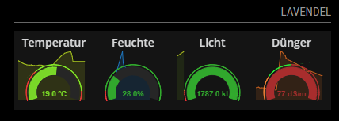
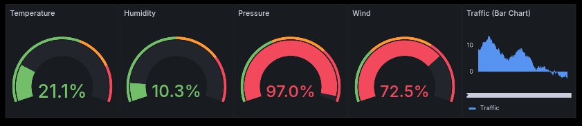
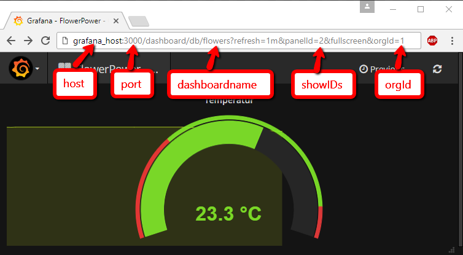

# MMM-GrafanaGauges

This [MagicMirror²](https://github.com/MagicMirrorOrg/MagicMirror) module allows you to display Grafana panels in a row. While originally designed for gauges, it works with any Grafana panel type—including bar charts, stat panels, tables, and more.

<b>Important Note:</b> This module requires a running Grafana installation. To install Grafana, follow the official [installation instructions](http://docs.grafana.org/installation/).

<b>[This blogpost](http://www.robstechlog.com/2017/06/30/personal-weather-chart-module/) describes how to install and use Grafana and build a weatherchart.</b><br>



## Installation of the module

In your terminal, go to your MagicMirror's module directory and clone this repository:
```bash
cd ~/MagicMirror/modules
git clone https://github.com/MagicMirrorModules/MMM-GrafanaGauges
```

Configure the module in your `config.js` file.

## Update

To update the module, navigate to the module's directory and pull the latest changes from the repository:
```bash
cd ~/MagicMirror/modules/MMM-GrafanaGauges
git pull
```

## Configuration

To use this module, you have to specify where your Grafana installation is hosted and which panels you'd like to display.

Add the module to the modules array in the `config/config.js` file:

```javascript
    {
      module: 'MMM-GrafanaGauges',
      position: 'top_right',   // This can be any of the regions.
      header: 'Olive tree',
      config: {
        version: 6, // Only add this line if you are using Grafana 6 or greater
        id: "as8fA8na", // Required for Grafana 6+ and is the dashboard UID from /d/<uid>/<name>
        host: "grafana_host", // Mandatory.
        port: 3000, // Mandatory.
        https: false, // Optional. Default: false.
        dashboardname: "flowers", // Mandatory.
        orgId: 1, // Mandatory.
        showIDs: [12, 8, 9, 10], // Mandatory. PanelId from the URL.
        width: "100%", // Optional. Default: 100%
        height: "100%", // Optional. Default: 100%
        refreshInterval: 900 // Optional. Default: 900 seconds.
      }
    },
```

Everything needed is extractable from the <code>url</code> when you're viewing your panel using Grafana in your browser.<br>
<b>The <code>panelid</code> from each panel has to be represented within the showIDs-array. The order in this array determines the display order.</b>



### Optional configuration options

The following properties can be configured:

| Option | Description |
| --- | --- |
| `width` | Width of the displayed chart. `'150 px'` or `'50 %'` are valid options. Default value: `"100%"`. |
| `height` | Height of the displayed chart. `'150 px'` or `'50 %'` are valid options. Default value: `"100%"`. |
| `refreshInterval` | Update interval of the diagram in seconds. Default value: `900` = 15 \* 60 (four times every hour). |

## Development

### Local Grafana test instance

This repository includes a ready-to-run Grafana test setup for validating the module locally.
No existing Grafana test instance is required. The scripts create and provision one automatically.
Prerequisite: Docker must be installed and running.

Start Grafana test instance:
```bash
node --run grafana:start
```

If port `3000` is already in use, set a custom port:
```bash
GRAFANA_TEST_PORT=3300 node --run grafana:start
```

Restart Grafana test instance:
```bash
node --run grafana:restart
```

Start MagicMirror demo with test config:
```bash
node --run demo
```

Stop Grafana test instance:
```bash
node --run grafana:stop
```

The script provisions a Grafana dashboard with these values:

- Dashboard URL: `http://localhost:3000/d/as8fA8na/flowers`
- Dashboard UID: `as8fA8na`
- Dashboard name: `flowers`
- Panel IDs: `8` (gauge), `9` (gauge), `10` (gauge), `12` (gauge), `13` (bar chart)

Use this MagicMirror config to test against the local Grafana instance:

```javascript
    {
      module: 'MMM-GrafanaGauges',
      position: 'top_right',
      header: 'Grafana test',
      config: {
        version: 6,
        id: 'as8fA8na',
        host: 'localhost',
        port: 3000,
        https: false,
        dashboardname: 'flowers',
        orgId: 1,
        showIDs: [8, 9, 10, 12, 13], // Try adding the bar chart panel (id 13)
        width: '220',
        height: '220',
        refreshInterval: 60
      }
    },
```

## Code of Conduct

Please note that this project is released with a [Contributor Code of Conduct](CODE_OF_CONDUCT.md). By participating in this project you agree to abide by its terms.

## License

This project is licensed under the MIT License - see the [LICENSE](LICENSE.md) file for details.
